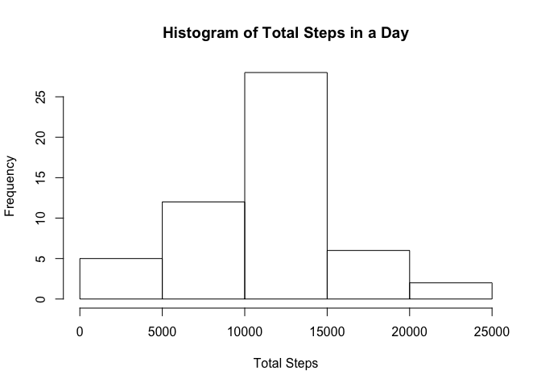
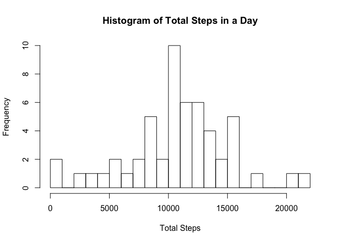
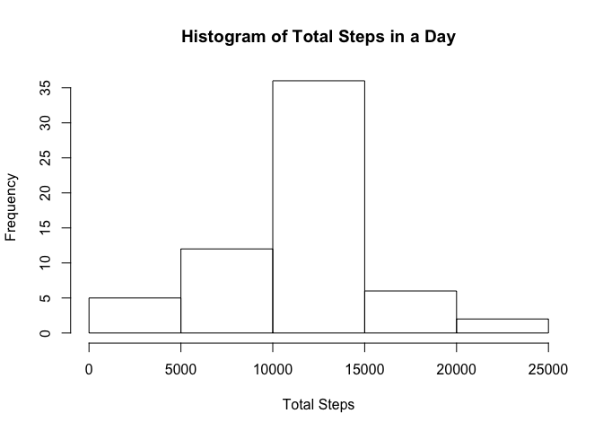

# Reproducible Research: Peer Assessment 1


## Loading and preprocessing the data
Start by loading the data into R.  The following code loads in a csv file called "activity.csv" which contains 3 columns:

- steps
- date
- interval

The steps is the number of stpes taken in a 5 minute interval.  Date is the date that the steps were taken on (2012-10-01 to 2012-11-30).  Interval is the interval thoughout the day.  Missing values are coded as NA.


```r
unzip("activity.zip")
activity <- read.csv("activity.csv")
```


## What is mean total number of steps taken per day?

Down below is the total number of steps taken per day.  I have created a new data.frame called total_steps that contains two columns of data.  The first column is the date (there are 53 values).  The second one is the sum of all the steps on that day.

Histogram information goes here

Below the histogram are two more data frames.  They are very similar to total_steps, but instead of showing totals, mean_daily_steps shows the mean and median_daily_steps shows the median.


```r
total_steps <- aggregate(steps ~ date, activity, sum)
hist(total_steps$steps, main = "Histogram of Total Steps in a Day", 
     xlab = "Total Steps")
```

 

```r
mean_daily_steps <- aggregate(steps ~ date, activity, mean)
median_daily_steps <- aggregate(steps ~ date, activity, median)
mean_daily_steps
```

```
##          date      steps
## 1  2012-10-02  0.4375000
## 2  2012-10-03 39.4166667
## 3  2012-10-04 42.0694444
## 4  2012-10-05 46.1597222
## 5  2012-10-06 53.5416667
## 6  2012-10-07 38.2465278
## 7  2012-10-09 44.4826389
## 8  2012-10-10 34.3750000
## 9  2012-10-11 35.7777778
## 10 2012-10-12 60.3541667
## 11 2012-10-13 43.1458333
## 12 2012-10-14 52.4236111
## 13 2012-10-15 35.2048611
## 14 2012-10-16 52.3750000
## 15 2012-10-17 46.7083333
## 16 2012-10-18 34.9166667
## 17 2012-10-19 41.0729167
## 18 2012-10-20 36.0937500
## 19 2012-10-21 30.6284722
## 20 2012-10-22 46.7361111
## 21 2012-10-23 30.9652778
## 22 2012-10-24 29.0104167
## 23 2012-10-25  8.6527778
## 24 2012-10-26 23.5347222
## 25 2012-10-27 35.1354167
## 26 2012-10-28 39.7847222
## 27 2012-10-29 17.4236111
## 28 2012-10-30 34.0937500
## 29 2012-10-31 53.5208333
## 30 2012-11-02 36.8055556
## 31 2012-11-03 36.7048611
## 32 2012-11-05 36.2465278
## 33 2012-11-06 28.9375000
## 34 2012-11-07 44.7326389
## 35 2012-11-08 11.1770833
## 36 2012-11-11 43.7777778
## 37 2012-11-12 37.3784722
## 38 2012-11-13 25.4722222
## 39 2012-11-15  0.1423611
## 40 2012-11-16 18.8923611
## 41 2012-11-17 49.7881944
## 42 2012-11-18 52.4652778
## 43 2012-11-19 30.6979167
## 44 2012-11-20 15.5277778
## 45 2012-11-21 44.3993056
## 46 2012-11-22 70.9270833
## 47 2012-11-23 73.5902778
## 48 2012-11-24 50.2708333
## 49 2012-11-25 41.0902778
## 50 2012-11-26 38.7569444
## 51 2012-11-27 47.3819444
## 52 2012-11-28 35.3576389
## 53 2012-11-29 24.4687500
```

```r
median_daily_steps
```

```
##          date steps
## 1  2012-10-02     0
## 2  2012-10-03     0
## 3  2012-10-04     0
## 4  2012-10-05     0
## 5  2012-10-06     0
## 6  2012-10-07     0
## 7  2012-10-09     0
## 8  2012-10-10     0
## 9  2012-10-11     0
## 10 2012-10-12     0
## 11 2012-10-13     0
## 12 2012-10-14     0
## 13 2012-10-15     0
## 14 2012-10-16     0
## 15 2012-10-17     0
## 16 2012-10-18     0
## 17 2012-10-19     0
## 18 2012-10-20     0
## 19 2012-10-21     0
## 20 2012-10-22     0
## 21 2012-10-23     0
## 22 2012-10-24     0
## 23 2012-10-25     0
## 24 2012-10-26     0
## 25 2012-10-27     0
## 26 2012-10-28     0
## 27 2012-10-29     0
## 28 2012-10-30     0
## 29 2012-10-31     0
## 30 2012-11-02     0
## 31 2012-11-03     0
## 32 2012-11-05     0
## 33 2012-11-06     0
## 34 2012-11-07     0
## 35 2012-11-08     0
## 36 2012-11-11     0
## 37 2012-11-12     0
## 38 2012-11-13     0
## 39 2012-11-15     0
## 40 2012-11-16     0
## 41 2012-11-17     0
## 42 2012-11-18     0
## 43 2012-11-19     0
## 44 2012-11-20     0
## 45 2012-11-21     0
## 46 2012-11-22     0
## 47 2012-11-23     0
## 48 2012-11-24     0
## 49 2012-11-25     0
## 50 2012-11-26     0
## 51 2012-11-27     0
## 52 2012-11-28     0
## 53 2012-11-29     0
```

## What is the average daily activity pattern?

Down below a new data.frame is created called time_interval_steps.  This data frame has two colums.  The first of which is the intervals.  The seond is the average number of steps per interval.

The plot is a time series showing the average number of steps per interval.  As you can see there is a large spike around interval 800 - 920.


```r
time_interval_steps <- aggregate(steps ~ interval, activity, mean)
plot(time_interval_steps$steps ~ time_interval_steps$interval, 
     type="l", main = "Average Number of Steps per Interval", 
     ylab="Number of Steps", xlab="Interval (5 minutes)")
```

 

```r
max <- max(time_interval_steps$steps)
Max_Interval <- subset(time_interval_steps, 
                       time_interval_steps$steps == max)
Max_Interval
```

```
##     interval    steps
## 104      835 206.1698
```


## Imputing missing values

As shown below there are 2304 missing data points in the data set.

To fill in the NA values, the NA's will be substatuted with the average value for the appropriate time interval.  The goal is to have a minimal effect on the overall analysis.

Adding in the estamets for different values, there are 8 more days accounted for than before. Yes they differ.


```r
NA_Values <- sum(is.na(activity$steps))
NA_Values
```

```
## [1] 2304
```

```r
activity2 <- activity ## copies the data set so that the original one is not modified
len <- nrow(activity2) ## calculates how many rows in the data set
for(i in 1:len){
    if(is.na(activity2$steps[i]) == TRUE){ ##checks to see if the value is missing
        int <- activity2$interval[i] ## caluclates the interval number
        temp <- subset(time_interval_steps, interval == int) ## creates a temporary data frame that has been subseted to the single interval value needed
        activity2$steps[i] <- temp$steps ## replaces the NA value with the average
    }
}
total_steps2 <- aggregate(steps ~ date, activity2, sum)
hist(total_steps2$steps, main = "Histogram of Total Steps in a Day", xlab = "Total Steps")
```

 

## Are there differences in activity patterns between weekdays and weekends?


