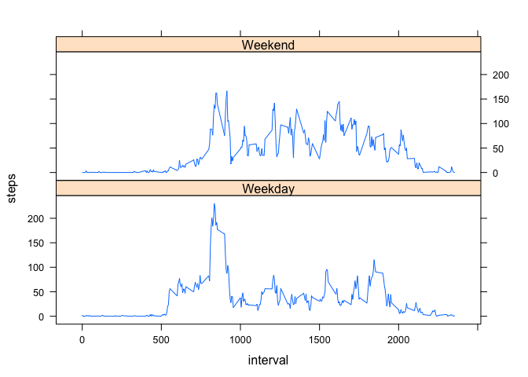

# Reproducible Research: Peer Assessment 1


## Loading and preprocessing the data
Start by loading the data into R.  The following code loads in a csv file called "activity.csv" which contains 3 columns:

- steps
- date
- interval

The steps is the number of stpes taken in a 5 minute interval.  Date is the date that the steps were taken on (2012-10-01 to 2012-11-30).  Interval is the interval thoughout the day.  Missing values are coded as NA.


```r
unzip("activity.zip")
activity <- read.csv("activity.csv")
```


## What is mean total number of steps taken per day?

Down below is the total number of steps taken per day.  I have created a new data.frame called total_steps that contains two columns of data.  The first column is the date (there are 53 values).  The second one is the sum of all the steps on that day.  The first 10 rows are shown below.  


```r
total_steps <- aggregate(steps ~ date, activity, sum)
head(total_steps, 10)
```

```
##          date steps
## 1  2012-10-02   126
## 2  2012-10-03 11352
## 3  2012-10-04 12116
## 4  2012-10-05 13294
## 5  2012-10-06 15420
## 6  2012-10-07 11015
## 7  2012-10-09 12811
## 8  2012-10-10  9900
## 9  2012-10-11 10304
## 10 2012-10-12 17382
```

From there a histogram can be built showing how frequently on any given day the subject was able to hit different step ammounts.  This histogram is broken into 20 buckets to to give greater differentiation to the graph.


```r
hist(total_steps$steps, main = "Histogram of Total Steps in a Day", 
     xlab = "Total Steps", breaks = 20)
```

 

Below the histogram are two more data frames.  They are very similar to total_steps, but instead of showing totals, mean_daily_steps shows the mean and median_daily_steps shows the median.  Also included is the overall mean (mean_steps) and mediean (median_steps) steps for the entire sample.


```r
mean_daily_steps <- aggregate(steps ~ date, activity, mean)
mean_steps <- mean(activity$steps, na.rm = TRUE)
median_daily_steps <- aggregate(steps ~ date, activity, median)
median_steps <- median(activity$steps, na.rm = TRUE)
mean_daily_steps
```

```
##          date      steps
## 1  2012-10-02  0.4375000
## 2  2012-10-03 39.4166667
## 3  2012-10-04 42.0694444
## 4  2012-10-05 46.1597222
## 5  2012-10-06 53.5416667
## 6  2012-10-07 38.2465278
## 7  2012-10-09 44.4826389
## 8  2012-10-10 34.3750000
## 9  2012-10-11 35.7777778
## 10 2012-10-12 60.3541667
## 11 2012-10-13 43.1458333
## 12 2012-10-14 52.4236111
## 13 2012-10-15 35.2048611
## 14 2012-10-16 52.3750000
## 15 2012-10-17 46.7083333
## 16 2012-10-18 34.9166667
## 17 2012-10-19 41.0729167
## 18 2012-10-20 36.0937500
## 19 2012-10-21 30.6284722
## 20 2012-10-22 46.7361111
## 21 2012-10-23 30.9652778
## 22 2012-10-24 29.0104167
## 23 2012-10-25  8.6527778
## 24 2012-10-26 23.5347222
## 25 2012-10-27 35.1354167
## 26 2012-10-28 39.7847222
## 27 2012-10-29 17.4236111
## 28 2012-10-30 34.0937500
## 29 2012-10-31 53.5208333
## 30 2012-11-02 36.8055556
## 31 2012-11-03 36.7048611
## 32 2012-11-05 36.2465278
## 33 2012-11-06 28.9375000
## 34 2012-11-07 44.7326389
## 35 2012-11-08 11.1770833
## 36 2012-11-11 43.7777778
## 37 2012-11-12 37.3784722
## 38 2012-11-13 25.4722222
## 39 2012-11-15  0.1423611
## 40 2012-11-16 18.8923611
## 41 2012-11-17 49.7881944
## 42 2012-11-18 52.4652778
## 43 2012-11-19 30.6979167
## 44 2012-11-20 15.5277778
## 45 2012-11-21 44.3993056
## 46 2012-11-22 70.9270833
## 47 2012-11-23 73.5902778
## 48 2012-11-24 50.2708333
## 49 2012-11-25 41.0902778
## 50 2012-11-26 38.7569444
## 51 2012-11-27 47.3819444
## 52 2012-11-28 35.3576389
## 53 2012-11-29 24.4687500
```

```r
mean_steps
```

```
## [1] 37.3826
```

```r
median_daily_steps
```

```
##          date steps
## 1  2012-10-02     0
## 2  2012-10-03     0
## 3  2012-10-04     0
## 4  2012-10-05     0
## 5  2012-10-06     0
## 6  2012-10-07     0
## 7  2012-10-09     0
## 8  2012-10-10     0
## 9  2012-10-11     0
## 10 2012-10-12     0
## 11 2012-10-13     0
## 12 2012-10-14     0
## 13 2012-10-15     0
## 14 2012-10-16     0
## 15 2012-10-17     0
## 16 2012-10-18     0
## 17 2012-10-19     0
## 18 2012-10-20     0
## 19 2012-10-21     0
## 20 2012-10-22     0
## 21 2012-10-23     0
## 22 2012-10-24     0
## 23 2012-10-25     0
## 24 2012-10-26     0
## 25 2012-10-27     0
## 26 2012-10-28     0
## 27 2012-10-29     0
## 28 2012-10-30     0
## 29 2012-10-31     0
## 30 2012-11-02     0
## 31 2012-11-03     0
## 32 2012-11-05     0
## 33 2012-11-06     0
## 34 2012-11-07     0
## 35 2012-11-08     0
## 36 2012-11-11     0
## 37 2012-11-12     0
## 38 2012-11-13     0
## 39 2012-11-15     0
## 40 2012-11-16     0
## 41 2012-11-17     0
## 42 2012-11-18     0
## 43 2012-11-19     0
## 44 2012-11-20     0
## 45 2012-11-21     0
## 46 2012-11-22     0
## 47 2012-11-23     0
## 48 2012-11-24     0
## 49 2012-11-25     0
## 50 2012-11-26     0
## 51 2012-11-27     0
## 52 2012-11-28     0
## 53 2012-11-29     0
```

```r
median_steps
```

```
## [1] 0
```

## What is the average daily activity pattern?

Down below a new data.frame is created called time_interval_steps.  This data frame has two colums.  The first of which is the intervals.  The seond is the average number of steps per interval.  The first 10 rows of the data.frame are shown below.


```r
time_interval_steps <- aggregate(steps ~ interval, activity, mean)
head(time_interval_steps, 10)
```

```
##    interval     steps
## 1         0 1.7169811
## 2         5 0.3396226
## 3        10 0.1320755
## 4        15 0.1509434
## 5        20 0.0754717
## 6        25 2.0943396
## 7        30 0.5283019
## 8        35 0.8679245
## 9        40 0.0000000
## 10       45 1.4716981
```

The plot is a time series showing the average number of steps per interval.  As you can see there is a large spike around interval 800 - 920.


```r
plot(time_interval_steps$steps ~ time_interval_steps$interval, 
     type="l", main = "Average Number of Steps per Interval", 
     ylab="Number of Steps", xlab="Interval (5 minutes)")
```

 

Actually calculating the max shows that the max is at interval 835 and in those 5 minutes the average is 206 steps.


```r
max <- max(time_interval_steps$steps)
Max_Interval <- subset(time_interval_steps, 
                       time_interval_steps$steps == max)
Max_Interval
```

```
##     interval    steps
## 104      835 206.1698
```


## Imputing missing values

As shown below there are 2304 missing data points in the data set.


```r
NA_Values <- sum(is.na(activity$steps))
NA_Values
```

```
## [1] 2304
```

To fill in the NA values, the NA's will be substatuted with the average value for the appropriate time interval.  The goal is to have a minimal effect on the overall analysis.


```r
activity2 <- activity ## copies the data set so that the original one is not modified
len <- nrow(activity2) ## calculates how many rows in the data set
for(i in 1:len){
    if(is.na(activity2$steps[i]) == TRUE){ ##checks to see if the value is missing
        int <- activity2$interval[i] ## caluclates the interval number
        temp <- subset(time_interval_steps, interval == int) ## creates a temporary data frame that has been subseted to the single interval value needed
        activity2$steps[i] <- temp$steps ## replaces the NA value with the average
    }
}
```

Adding in the estamets for different values, there are 8 more days accounted for than before. Yes they differ.  The same histogram is shown below, except that it contains the estimated data.


```r
total_steps2 <- aggregate(steps ~ date, activity2, sum)
hist(total_steps2$steps, main = "Histogram of Total Steps in a Day", xlab = "Total Steps", breaks = 20)
```

 

Below the histogram are two more data frames.  These are the same calculations as before except that they contain the estimated data.  This had minimal (not noticeable) effects on the mean/median.


```r
mean_daily_steps2 <- aggregate(steps ~ date, activity2, mean)
mean_steps2 <- mean(activity2$steps, na.rm = TRUE)
median_daily_steps2 <- aggregate(steps ~ date, activity2, median)
median_steps2 <- median(activity2$steps, na.rm = TRUE)
mean_daily_steps2
```

```
##          date      steps
## 1  2012-10-01 37.3825996
## 2  2012-10-02  0.4375000
## 3  2012-10-03 39.4166667
## 4  2012-10-04 42.0694444
## 5  2012-10-05 46.1597222
## 6  2012-10-06 53.5416667
## 7  2012-10-07 38.2465278
## 8  2012-10-08 37.3825996
## 9  2012-10-09 44.4826389
## 10 2012-10-10 34.3750000
## 11 2012-10-11 35.7777778
## 12 2012-10-12 60.3541667
## 13 2012-10-13 43.1458333
## 14 2012-10-14 52.4236111
## 15 2012-10-15 35.2048611
## 16 2012-10-16 52.3750000
## 17 2012-10-17 46.7083333
## 18 2012-10-18 34.9166667
## 19 2012-10-19 41.0729167
## 20 2012-10-20 36.0937500
## 21 2012-10-21 30.6284722
## 22 2012-10-22 46.7361111
## 23 2012-10-23 30.9652778
## 24 2012-10-24 29.0104167
## 25 2012-10-25  8.6527778
## 26 2012-10-26 23.5347222
## 27 2012-10-27 35.1354167
## 28 2012-10-28 39.7847222
## 29 2012-10-29 17.4236111
## 30 2012-10-30 34.0937500
## 31 2012-10-31 53.5208333
## 32 2012-11-01 37.3825996
## 33 2012-11-02 36.8055556
## 34 2012-11-03 36.7048611
## 35 2012-11-04 37.3825996
## 36 2012-11-05 36.2465278
## 37 2012-11-06 28.9375000
## 38 2012-11-07 44.7326389
## 39 2012-11-08 11.1770833
## 40 2012-11-09 37.3825996
## 41 2012-11-10 37.3825996
## 42 2012-11-11 43.7777778
## 43 2012-11-12 37.3784722
## 44 2012-11-13 25.4722222
## 45 2012-11-14 37.3825996
## 46 2012-11-15  0.1423611
## 47 2012-11-16 18.8923611
## 48 2012-11-17 49.7881944
## 49 2012-11-18 52.4652778
## 50 2012-11-19 30.6979167
## 51 2012-11-20 15.5277778
## 52 2012-11-21 44.3993056
## 53 2012-11-22 70.9270833
## 54 2012-11-23 73.5902778
## 55 2012-11-24 50.2708333
## 56 2012-11-25 41.0902778
## 57 2012-11-26 38.7569444
## 58 2012-11-27 47.3819444
## 59 2012-11-28 35.3576389
## 60 2012-11-29 24.4687500
## 61 2012-11-30 37.3825996
```

```r
mean_steps2
```

```
## [1] 37.3826
```

```r
median_daily_steps2
```

```
##          date    steps
## 1  2012-10-01 34.11321
## 2  2012-10-02  0.00000
## 3  2012-10-03  0.00000
## 4  2012-10-04  0.00000
## 5  2012-10-05  0.00000
## 6  2012-10-06  0.00000
## 7  2012-10-07  0.00000
## 8  2012-10-08 34.11321
## 9  2012-10-09  0.00000
## 10 2012-10-10  0.00000
## 11 2012-10-11  0.00000
## 12 2012-10-12  0.00000
## 13 2012-10-13  0.00000
## 14 2012-10-14  0.00000
## 15 2012-10-15  0.00000
## 16 2012-10-16  0.00000
## 17 2012-10-17  0.00000
## 18 2012-10-18  0.00000
## 19 2012-10-19  0.00000
## 20 2012-10-20  0.00000
## 21 2012-10-21  0.00000
## 22 2012-10-22  0.00000
## 23 2012-10-23  0.00000
## 24 2012-10-24  0.00000
## 25 2012-10-25  0.00000
## 26 2012-10-26  0.00000
## 27 2012-10-27  0.00000
## 28 2012-10-28  0.00000
## 29 2012-10-29  0.00000
## 30 2012-10-30  0.00000
## 31 2012-10-31  0.00000
## 32 2012-11-01 34.11321
## 33 2012-11-02  0.00000
## 34 2012-11-03  0.00000
## 35 2012-11-04 34.11321
## 36 2012-11-05  0.00000
## 37 2012-11-06  0.00000
## 38 2012-11-07  0.00000
## 39 2012-11-08  0.00000
## 40 2012-11-09 34.11321
## 41 2012-11-10 34.11321
## 42 2012-11-11  0.00000
## 43 2012-11-12  0.00000
## 44 2012-11-13  0.00000
## 45 2012-11-14 34.11321
## 46 2012-11-15  0.00000
## 47 2012-11-16  0.00000
## 48 2012-11-17  0.00000
## 49 2012-11-18  0.00000
## 50 2012-11-19  0.00000
## 51 2012-11-20  0.00000
## 52 2012-11-21  0.00000
## 53 2012-11-22  0.00000
## 54 2012-11-23  0.00000
## 55 2012-11-24  0.00000
## 56 2012-11-25  0.00000
## 57 2012-11-26  0.00000
## 58 2012-11-27  0.00000
## 59 2012-11-28  0.00000
## 60 2012-11-29  0.00000
## 61 2012-11-30 34.11321
```

```r
median_steps2
```

```
## [1] 0
```

## Are there differences in activity patterns between weekdays and weekends?

The first step to comparing the step patters over the work_week and weekend, is differentiating what is the week and weekend.  The following uses the weekdays function to calculate what day of the week the date is, and then the second for loop determines the weekday or weekend.


```r
day_of_week <- c() ## epmty vector
## calculates the day of the week
for(i in 1:len){
    day_of_week[i] <- weekdays(as.POSIXlt(activity2$date[i]))
}
## creates a new column stating the day of the week
activity3 <- cbind(activity2, day_of_week)

week <- c()
for(i in 1:len){
    if(day_of_week[i] == "Saturday" | day_of_week[i] == "Sunday"){
        week[i] <- "Weekend"
    }
    else {
        week[i] <- "Weekday"
    }
}
activity4 <- cbind(activity3, week)
```

At this point there is a new data.frame called activity4.  This data.frame is the same as the orriginal data read in except for:

- the substatutions for the NA values
- a third column denoting the work week
- a forth column denoting if it is a weekday or weekend

Below is the first 10 rows in the average number of steps per interval seperated by weekday and weekend.


```r
mean_day_end_steps <- aggregate(steps ~ week + interval, activity4, mean)
head(mean_day_end_steps, 10)
```

```
##       week interval       steps
## 1  Weekday        0 2.251153040
## 2  Weekend        0 0.214622642
## 3  Weekday        5 0.445283019
## 4  Weekend        5 0.042452830
## 5  Weekday       10 0.173165618
## 6  Weekend       10 0.016509434
## 7  Weekday       15 0.197903564
## 8  Weekend       15 0.018867925
## 9  Weekday       20 0.098951782
## 10 Weekend       20 0.009433962
```

Below is a time series plot showing the number of steps per interval during the weekdays and weekends.  One observation is that the steps are more spread out throughout the day on the weekends.  On the weekdays there is a spike in the beginning and then it settles down.  This is possibly from people excesising in the morning before starting work, and theb working at a desk for 8-9 hrs.


```r
library("lattice")
## create the weekend vs weekdays plot
xyplot(steps ~ interval | week, data = mean_day_end_steps, 
       type = "l", layout = c(1, 2))
```

 
